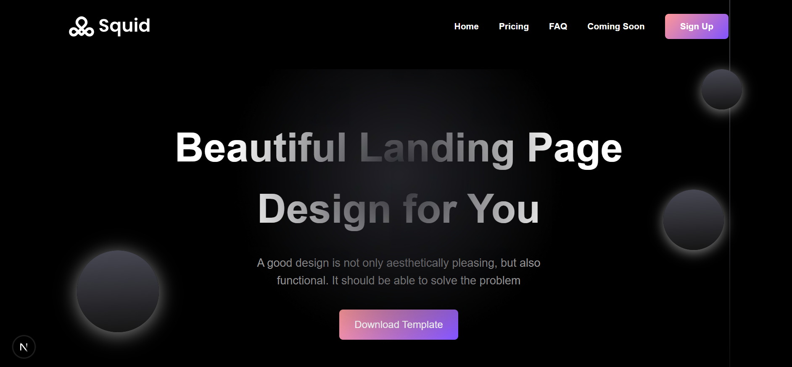
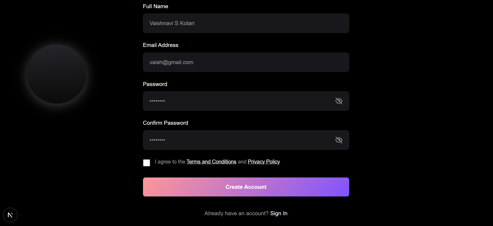
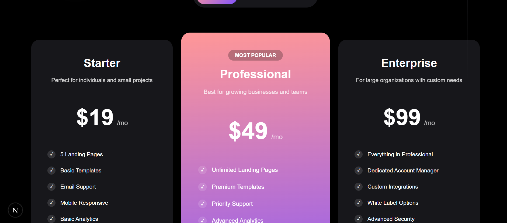
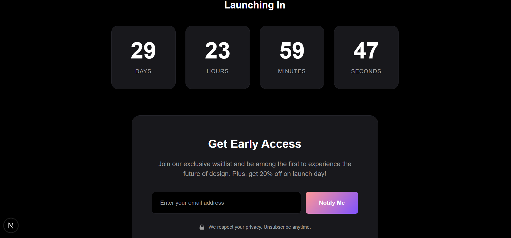

# SAAS-LANDING-PLATFORM

A modern and responsive SaaS landing page built using **Next.js** and **Tailwind CSS**.  
The project includes authentication pages, pricing, FAQ, and a coming soon page.

---

## Setup

```bash
cd your-repo-name
npm install
npm run dev

```
## Features

  -Responsive SaaS Landing Page

  -Home, Pricing, FAQ, and Coming Soon pages

  -Login and Registration pages

  -Client-side authentication using localStorage

  -Redirect to Home after login

  -Reusable UI components

## Decisions & Trade-offs

  -Frontend-only authentication for simplicity and easy demo
  
  -No backend or database (not production-ready)

  -Tailwind CSS used for faster UI development

## Screenshots

### Home Page


### Registration Page


### Pricing Page


### Coming Soon Page

